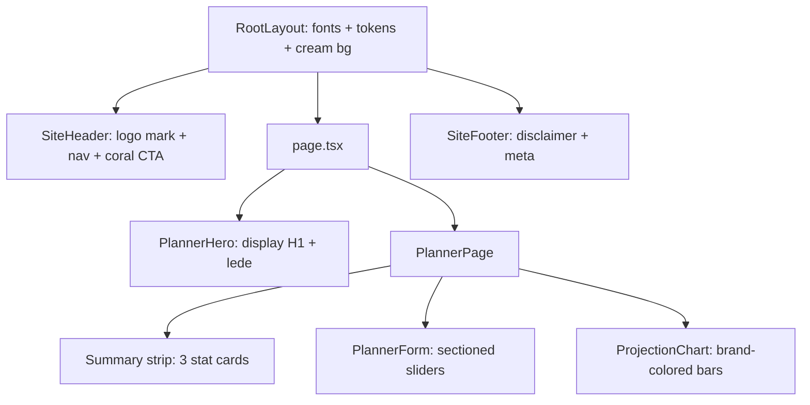

## Visual direction (Boldin-inspired)

- Palette tokens (added as CSS custom properties in [app/src/app/globals.css](app/src/app/globals.css))
  - `--navy: #0F2239` (primary ink / nav background)
  - `--navy-soft: #1B3355`
  - `--teal: #00C6B8` (primary accent, positive values, sliders)
  - `--coral: #FF7A59` (CTA, negative values, highlights)
  - `--cream: #F7F5EF` (page background)
  - `--ink-soft: #4B5B74`
  - `--surface: #FFFFFF`, `--border: #E6E3DA`
- Typography via `next/font/google` in [app/src/app/layout.tsx](app/src/app/layout.tsx)
  - Display: `Fraunces` (variable, wght 400/500, opsz) for H1/H2 — editorial warmth like Boldin's headlines
  - Body: `Inter` (variable) for everything else
  - Exposed as `--font-display` and `--font-sans` so Tailwind's `font-sans` stays Inter and a new `font-display` class picks up Fraunces
- Shape/elevation: `rounded-2xl`, `shadow-[0_1px_2px_rgba(15,34,57,0.04),0_8px_24px_-12px_rgba(15,34,57,0.12)]`, 1px borders in `--border`. Generous padding (`p-6`/`p-8`).

## Component structure after restyle

## Files to change / add

- New [app/src/components/SiteHeader.tsx](app/src/components/SiteHeader.tsx)
  - Sticky top bar on white/cream, small teal logo mark (inline SVG) + "Retirement Planner" wordmark in Fraunces, right-aligned "Start planning" coral button (visual only, scrolls to form).
- New [app/src/components/SiteFooter.tsx](app/src/components/SiteFooter.tsx)
  - Thin footer with disclaimer line, copyright, and small muted links ("Privacy", "Terms" — placeholders).
- New [app/src/features/planner/PlannerHero.tsx](app/src/features/planner/PlannerHero.tsx)
  - Editorial H1 in Fraunces: "Plan the retirement you actually want." + sub-lede + a single coral CTA chip linking to the form anchor. Subtle cream-to-white gradient background.
- [app/src/app/layout.tsx](app/src/app/layout.tsx)
  - Load `Inter` + `Fraunces` via `next/font/google`, attach font CSS variables to `<html>`, set metadata title/description, wrap `children` with `SiteHeader` and `SiteFooter`, set body to `bg-[var(--cream)] text-[var(--navy)] antialiased`.
- [app/src/app/globals.css](app/src/app/globals.css)
  - Add `:root` tokens above, set `body { background: var(--cream); color: var(--navy); }`, selection/scrollbar polish, `.font-display { font-family: var(--font-display), serif; }`.
- [app/src/app/page.tsx](app/src/app/page.tsx)
  - Render `<PlannerHero />` above `<PlannerPage />` inside a single max-width container; add `id="planner"` anchor.
- [app/src/features/planner/PlannerPage.tsx](app/src/features/planner/PlannerPage.tsx)
  - Replace current ad-hoc card classes with a design-system card: `rounded-2xl border border-[var(--border)] bg-white p-6 shadow-sm`.
  - Summary strip: 3 equal cards, small caps eyebrow in `--ink-soft`, value in `font-display text-3xl`, subtle teal underline accent on the hovered/active card.
  - Two-column grid on `lg`: left form card, right chart card (same styling, sticky header "Projection").
- [app/src/features/planner/PlannerForm.tsx](app/src/features/planner/PlannerForm.tsx)
  - Group sliders into two sections with small eyebrow headings: "About you" (Name, DOB) and "Your numbers" (5 existing sliders + horizon).
  - Style range inputs with Tailwind: `accent-[var(--teal)]`, custom track via `[&::-webkit-slider-runnable-track]:h-1.5 [&::-webkit-slider-runnable-track]:bg-[var(--border)] [&::-webkit-slider-runnable-track]:rounded-full` and thumb `[&::-webkit-slider-thumb]:h-4 [&::-webkit-slider-thumb]:w-4 [&::-webkit-slider-thumb]:rounded-full [&::-webkit-slider-thumb]:bg-[var(--teal)] [&::-webkit-slider-thumb]:shadow` (+ mozilla equivalents).
  - Replace the big number input below each slider with a compact, right-aligned display that flips into an editable input on focus (keeps current UX but visually calmer).
  - "Reset to defaults" becomes a text link in `--ink-soft` with a coral hover.
- [app/src/features/planner/ProjectionChart.tsx](app/src/features/planner/ProjectionChart.tsx)
  - Bar fill uses brand colors: `var(--teal)` for positive, `var(--coral)` for negative (read tokens via `getComputedStyle` on mount, or inline fallbacks `#00C6B8` / `#FF7A59` for SSR-safe defaults).
  - Tooltip: custom component with rounded-xl white surface, 1px `--border`, navy title in Fraunces, Inter body. Axis ticks use `--ink-soft` and 11px Inter. Grid stroke `--border`.
  - Height bumped to `h-[440px]`, rounded bars via `radius={[6,6,0,0]}`.

## Not in scope (flagging)

- No dark mode (Boldin is light-first; can add later).
- No shadcn/ui install — existing elements restyled with Tailwind + tokens to keep the change small.
- No copy rewrite beyond the hero headline and header/footer text.
- Tests remain untouched (pure visual changes; calculator/storage logic is unchanged).

## Validation

- `npm run typecheck` and `npm run test` stay green (no logic changes).
- Visual smoke: page loads with cream background, navy nav, teal CTA, Fraunces H1, planner cards rounded with shadow, chart bars teal/coral, sliders with teal thumb, footer visible at bottom.
