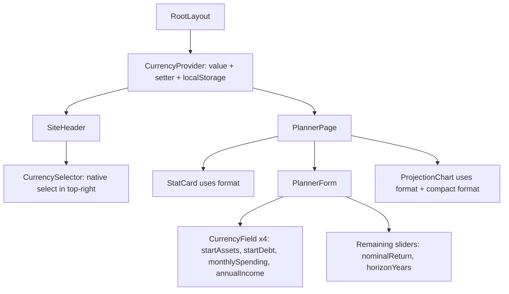

## Data & architecture

- 12 currencies: `EUR, USD, GBP, CHF, CAD, AUD, JPY, SEK, NOK, DKK, SGD, HKD`. Default `EUR`.
- All formatting via `Intl.NumberFormat("en-US", { style: "currency", currency, maximumFractionDigits: 0 })` — uniform thousand separators with the correct symbol; `JPY` naturally renders without decimals.
- Currency is stored in React context so every component reads one value; persisted under `app.currency.v1` in localStorage (same pattern as existing `planner.inputs.v1`).

## New files

- [app/src/features/currency/types.ts](app/src/features/currency/types.ts) — `CurrencyCode` union + `CURRENCIES` list with `{ code, label }` for the selector.
- [app/src/features/currency/format.ts](app/src/features/currency/format.ts) — pure helpers:
  - `formatCurrency(value: number, code: CurrencyCode): string` using `Intl.NumberFormat` with `maximumFractionDigits: 0`.
  - `formatCurrencyCompact(value: number, code: CurrencyCode): string` — symbol + `1.2K` / `1.2M` / `1.2B`; derives symbol once via `Intl.NumberFormat(...).formatToParts(0)`.
  - `parseCurrencyInput(raw: string): number` — strips everything except digits and a leading minus, returns `Number`.
- [app/src/features/currency/CurrencyContext.tsx](app/src/features/currency/CurrencyContext.tsx) — `"use client"` context with `{ code, setCode, format, formatCompact }`. Loads persisted code on mount (matches `PlannerPage` hydration pattern). Exports `CurrencyProvider` and `useCurrency()`.
- [app/src/features/currency/CurrencySelector.tsx](app/src/features/currency/CurrencySelector.tsx) — compact native `<select>` styled like `.text-input` with `--teal` focus ring; shows `EUR`, `USD`, etc. Using a native select avoids adding a headless-ui/shadcn dependency and stays keyboard-accessible.
- [app/src/features/planner/CurrencyField.tsx](app/src/features/planner/CurrencyField.tsx) — controlled numeric input with live formatting:
  - Props: `{ label, helper?, value, onChange, min?, max? }`.
  - Derives a display string from `value` via `formatCurrency`. While typing, maintains an internal draft string so the caret stays stable; on every keystroke parses with `parseCurrencyInput` and calls `onChange(parsed)`. On blur, re-syncs draft to the canonical formatted value. Enter commits and blurs.
  - Visual: label + optional helper text (e.g. "per month", "per year"), input with the currency symbol rendered as a left-side adornment for clarity: `€<input inputMode="numeric" />`.
  - Clamps to `min`/`max` on blur (per-field soft bounds below).

## Files to modify

- [app/src/app/layout.tsx](app/src/app/layout.tsx) — wrap `children` in `<CurrencyProvider>` between `SiteHeader` and `SiteFooter` so both consume the same context.
- [app/src/components/SiteHeader.tsx](app/src/components/SiteHeader.tsx) — insert `<CurrencySelector />` immediately before the `Start planning` CTA (hidden on very narrow screens via `hidden sm:inline-flex`).
- [app/src/features/planner/PlannerForm.tsx](app/src/features/planner/PlannerForm.tsx)
  - Remove `startAssets`, `startDebt`, `monthlySpending`, and `annualIncome` from the `SLIDERS` array (only `nominalReturn` and `horizonYears` remain as sliders).
  - In the "Your numbers" fieldset, render a small grid of four `<CurrencyField>` inputs at the top (2-col on `sm+`), then the two remaining sliders underneath.
    - `startAssets` — label "Starting financial assets", helper "today", bounds `[0, 100_000_000]`
    - `startDebt` — label "Starting total debt", helper "today", bounds `[0, 50_000_000]`
    - `monthlySpending` — label "Base monthly spending", helper "per month, in today's money", bounds `[0, 1_000_000]`
    - `annualIncome` — label "Base annual non-rental income", helper "per year, in today's money", bounds `[0, 10_000_000]`
  - Drop the hard-coded `currency` formatter; `nominalReturn`/`horizonYears` keep their existing `percent`/`years` formatters — no currency hook needed for them.
- [app/src/features/planner/PlannerPage.tsx](app/src/features/planner/PlannerPage.tsx) — replace the inline `toLocaleString` block for `finalNetWorthLabel` with `format(finalPoint.netWorth)` from `useCurrency()`.
- [app/src/features/planner/ProjectionChart.tsx](app/src/features/planner/ProjectionChart.tsx)
  - Accept currency via `useCurrency()` (component is already `"use client"`).
  - Y-axis `tickFormatter` and the custom tooltip use `formatCompact` / `format` from the hook.
  - Drop the local `compactCurrency` / `fullCurrency` helpers.

## Number handling details

- `parseCurrencyInput("€1,234")` returns `1234`; `parseCurrencyInput("1 234 567")` returns `1234567`.
- Since we use `maximumFractionDigits: 0`, users cannot type cents; this matches the planner's integer-only model today.
- `CurrencyField` sets `inputMode="numeric"` (mobile numeric pad) but the input `type="text"` so we control formatting.
- Soft bounds per amount field (see PlannerForm bullet above); enforced on blur, not during keystrokes, to keep typing fluid.

## Persistence

- `CurrencyProvider` loads `localStorage.getItem("app.currency.v1")`, validates the code is in the union, falls back to `EUR`. Writes on every `setCode` (guarded by hydration flag, identical pattern to `saveInputs` / `loadInputs` in [app/src/features/planner/storage.ts](app/src/features/planner/storage.ts)).
- No migration of the existing planner inputs — all four amounts remain plain numbers in `PlanInputs`; only the UI control changes.

## Validation

- `npm run typecheck` stays green.
- `npm run test` stays green (existing tests assert calculator/storage logic and do not depend on currency formatting strings).
- Manual smoke: switch currency to USD/GBP/JPY, confirm header selector updates and all four amount fields, summary cards, and chart axes/tooltip reflect the new symbol and thousand separators. Reload the page and confirm the selection persists. Type into an amount field: see live formatting (e.g. `€1,234,567`), then blur and confirm clamp to the per-field bounds.

## Not in scope

- No FX conversion — switching the selector swaps the symbol/formatting, it does not convert amounts.
- No fractional-cent support or per-locale decimal separators (Intl symbol, US-style separators for consistency).
- No new dependencies; `CurrencyField` is written from scratch rather than pulling in `react-number-format`.
