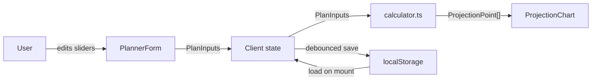

# Financial Planner MVP + Local Prep Plan

## Prep Steps (do first)

1. **Git init + first commit** in `/Users/jeffmarois/saas-browser-app` so all subsequent changes are reversible.
2. **Copy `.env.example` to `.env.local`** so local overrides are isolated.
3. **Add `.nvmrc`** with `22` to pin Node version.
4. **Add `.editorconfig`** to standardize indentation/newlines across editors.
5. **Add Prettier** (dev dep + `.prettierrc`) and an `npm run format` script in `[app/package.json](app/package.json)`.

## Product Scope (MVP)

- Single-user, local-only (no accounts, no Supabase yet).
- Inputs persisted via `localStorage`.
- Five core inputs for v1, with sliders + number fields:
  - Starting financial assets
  - Starting total debt
  - Base monthly spending (today dollars)
  - Base annual non-rental income (today dollars)
  - Nominal return on financial assets (%)
- User identity inputs: `name`, `dateOfBirth`.
- Deterministic projection only (no Monte Carlo yet).
- Primary output: line chart of projected net worth per year until age 95.

## Feature Architecture

Everything lives in a new feature slice at `[app/src/features/planner/](app/src/features/planner/)`:

- `[app/src/features/planner/types.ts](app/src/features/planner/types.ts)` — `PlanInputs`, `ProjectionPoint`
- `[app/src/features/planner/calculator.ts](app/src/features/planner/calculator.ts)` — pure deterministic projection function
- `[app/src/features/planner/storage.ts](app/src/features/planner/storage.ts)` — `loadInputs` / `saveInputs` helpers over `localStorage`
- `[app/src/features/planner/PlannerForm.tsx](app/src/features/planner/PlannerForm.tsx)` — name, DOB, slider+number inputs
- `[app/src/features/planner/ProjectionChart.tsx](app/src/features/planner/ProjectionChart.tsx)` — Recharts line chart
- `[app/src/features/planner/PlannerPage.tsx](app/src/features/planner/PlannerPage.tsx)` — client component composing form + chart

Replace current homepage `[app/src/app/page.tsx](app/src/app/page.tsx)` to render `PlannerPage`.

Add one dependency: `recharts` (lightweight, Next.js-friendly).

## Data Flow



## Calculation Logic (v1, deterministic)

For each year `i` from current age to 95:
- `assets_i = assets_{i-1} * (1 + nominalReturn) - (monthlySpending * 12) + annualIncome`
- `debt_i = debt_{i-1}` (held flat in MVP; debt dynamics added later)
- `netWorth_i = assets_i - debt_i`

Age is derived from `dateOfBirth`. Horizon is fixed at age 95 for MVP.

Example essential snippet in `calculator.ts`:

```ts
export function projectNetWorth(input: PlanInputs): ProjectionPoint[] {
  const currentAge = ageFromDob(input.dateOfBirth);
  const years = Math.max(0, 95 - currentAge);
  let assets = input.startAssets;
  const debt = input.startDebt;
  const points: ProjectionPoint[] = [];
  for (let i = 0; i <= years; i += 1) {
    const year = new Date().getFullYear() + i;
    if (i > 0) {
      assets = assets * (1 + input.nominalReturn) - input.monthlySpending * 12 + input.annualIncome;
    }
    points.push({ year, age: currentAge + i, netWorth: assets - debt });
  }
  return points;
}
```

## UI Approach

- Native `<input type="range">` sliders paired with number inputs (no extra UI libs yet).
- Tailwind-based layout, mobile-first, two-column on desktop: inputs left, chart right.
- "Reset to defaults" button.
- Inputs update chart live (recompute is O(years), fast enough for every keystroke).

## Success Criteria

- `npm run dev` serves a working planner at `http://localhost:3000`.
- Changing any slider instantly updates the chart.
- Refreshing the page restores last-entered values.
- `npm run typecheck`, `npm run test`, and `npm run build` all pass.
- Git history starts cleanly with prep + planner commits.

## Out of Scope (Deferred)

- Monte Carlo "chance of success" simulation
- Remaining Excel inputs (rentals, inflation, property growth, debt paydown schedule, etc.)
- Supabase accounts and cross-device persistence
- Stripe paywall (structure already scaffolded)
- Deployment to Vercel