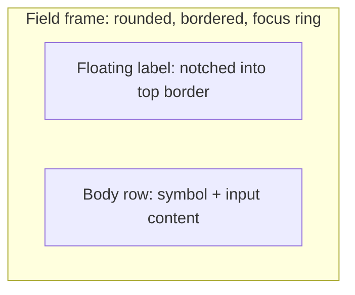

## Root cause of the overlap

Currently [app/src/features/planner/CurrencyField.tsx](app/src/features/planner/CurrencyField.tsx) uses an absolutely-positioned `<span>` for the symbol and `pl-8` on the input. In [app/src/app/globals.css](app/src/app/globals.css) the `.text-input` class defines `padding: 0.5rem 0.75rem` — same specificity as the Tailwind `pl-8` utility but declared after Tailwind's layer, so it wins and the input has no left padding. The `$`/`€` ends up on top of the digits.

The fix is structural: drop the absolute adornment entirely and put the symbol as a flex-child inside a shared framed container, so it reserves its own space.

## Visual target



All framed fields share the same visual: rounded-xl, 1px border, teal border + soft ring on focus-within, and a label pill that sits over the top-left edge (bg-white punches through the border).

## New/changed files

- [app/src/app/globals.css](app/src/app/globals.css) — add `.field-frame`, `.field-label`, `.field-body`, `.field-symbol`, `.field-input` classes. Remove the `.text-input` padding (or leave as-is and stop using it on framed inputs). Approximate CSS:

```css
.field-frame {
  position: relative;
  border-radius: 0.75rem;
  border: 1px solid var(--border);
  background: var(--surface);
  padding: 1.125rem 1rem 0.625rem;
  transition: border-color 120ms ease, box-shadow 120ms ease;
}
.field-frame:focus-within {
  border-color: var(--teal);
  box-shadow: 0 0 0 3px color-mix(in oklab, var(--teal) 20%, transparent);
}
.field-label {
  position: absolute;
  left: 0.75rem;
  top: -0.5rem;
  padding: 0 0.375rem;
  background: var(--surface);
  font-size: 0.6875rem;
  letter-spacing: 0.02em;
  color: var(--ink-soft);
  line-height: 1;
}
.field-body { display: flex; align-items: center; gap: 0.5rem; }
.field-symbol { color: var(--ink-soft); font-weight: 500; }
.field-input {
  flex: 1; min-width: 0; width: 100%;
  border: 0; outline: 0; background: transparent;
  padding: 0; font-size: 1rem; color: var(--navy);
}
.field-input::placeholder { color: var(--ink-muted); }
```

- New [app/src/features/planner/FramedField.tsx](app/src/features/planner/FramedField.tsx) — tiny wrapper that renders the frame + notched label + body row; accepts `children` (any input/select content) and an optional `helper`. Helper is rendered as `<p className="mt-1.5 text-[11px] text-[var(--ink-muted)]">` below the frame.

  ```tsx
  export function FramedField({ label, helper, children }: {
    label: string; helper?: string; children: React.ReactNode;
  }) {
    return (
      <div>
        <div className="field-frame">
          <div className="field-label">{label}</div>
          <div className="field-body">{children}</div>
        </div>
        {helper ? <p className="mt-1.5 text-[11px] text-[var(--ink-muted)]">{helper}</p> : null}
      </div>
    );
  }
  ```

- [app/src/features/planner/CurrencyField.tsx](app/src/features/planner/CurrencyField.tsx) — rewrite to use `FramedField`:
  - Body is `<span className="field-symbol">{symbol}</span><input className="field-input tabular-nums" ... />`
  - Keeps the existing draft/parse/clamp logic and the `min/max`, `onChange` props.
  - Props stay the same (`label, helper?, value, onChange, min?, max?`) so callers don't change.

- [app/src/features/planner/PlannerForm.tsx](app/src/features/planner/PlannerForm.tsx) — wrap Name and Date of birth in `FramedField`:
  - Replace each `<label class="flex flex-col ..."><span>Name</span><input class="text-input" .../></label>` with:
    `<FramedField label="Name"><input className="field-input" .../></FramedField>`
    (same for DOB with `type="date"`).
  - Four `CurrencyField`s continue to work as-is after the internal rewrite.

## Interaction / accessibility

- The floating label is a plain `<div>`, not an `<label htmlFor=...>`, to keep the component drop-in. Each interactive control inside already gets an `aria-label` (existing `CurrencyField`) or uses native behavior (name/DOB `<input>` wrapped by caller supplies `aria-label` in the new markup). I'll add `aria-label={label}` where needed so screen readers still announce the field name.
- Focus ring comes from `:focus-within` on the frame; the input itself drops its outline. Keyboard tab order is unchanged.

## Not in scope

- The header `CurrencySelector` keeps its current compact pill style (it's a selector in a header, not a data field, and the framed look would be too heavy there).
- Slider rows stay unchanged.
- No dependency additions.

## Validation

- `npm run typecheck` and `npm run test` stay green (pure UI restructure, no API changes).
- Visual smoke: load the planner, confirm Name, DOB, and the four amount fields render as framed boxes with top-left notched labels, symbol visible to the left of the digits with proper gap, focus ring is teal, helpers appear below currency fields.
