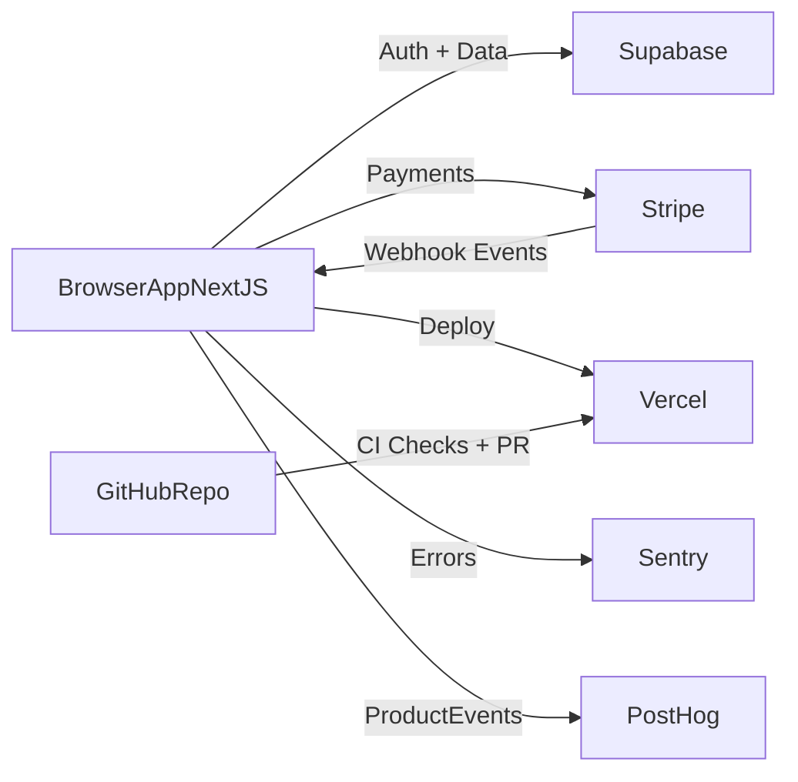

# Commercial SaaS Browser App Plan (Fastest Launch)

## Recommended Stack
- **Frontend**: Next.js (App Router) + TypeScript + Tailwind + shadcn/ui
- **Auth + DB + Storage**: Supabase (Auth, Postgres, file storage)
- **Payments**: Stripe (subscriptions, webhooks, customer portal)
- **Hosting**: Vercel (preview deployments + production)
- **Email/Notifications**: Resend
- **Monitoring**: Sentry + Vercel Analytics
- **Product Analytics**: PostHog
- **Background jobs**: Trigger.dev (or Inngest) for async workflows

This stack minimizes setup time while staying commercial-ready.

## GitHub Architecture
- Create one main repo (monorepo-ready even if starting with one app):
  - `[app/](app/)` (Next.js app)
  - `[packages/ui/](packages/ui/)` (shared UI components later)
  - `[packages/config/](packages/config/)` (eslint/tsconfig presets later)
  - `[infra/](infra/)` (deployment/docs/runbooks)
  - `[.github/workflows/](.github/workflows/)` (CI/CD pipelines)
- Protect `main` branch:
  - Require PRs, checks, and at least one approval
  - Disallow direct pushes
- Environments in GitHub: `preview`, `staging` (optional early), `production`

## Delivery Workflow
- Trunk-based development with short-lived feature branches
- Every PR:
  - Lint + typecheck + unit tests
  - Preview deployment via Vercel
- Merge to `main`:
  - Auto deploy to production (or staging-first if preferred)

## CI/CD Plan (GitHub Actions)
Add these workflows in `[.github/workflows/](.github/workflows/)`:
- `ci.yml`: install, lint, typecheck, test, build
- `preview.yml`: ensure preview URL is posted on PR
- `release.yml` (later): tag-based release notes/changelog automation

## Environment & Secrets Strategy
- Keep all secrets in GitHub/Vercel/Supabase/Stripe secret managers
- Use `.env.example` with non-sensitive placeholders only
- Split env vars by environment (`preview`, `production`)
- Rotate keys quarterly (or immediately on exposure)

## App Architecture (Initial)
- Vertical slices under `[app/src/features/](app/src/features/)`: `auth`, `billing`, `projects`, `settings`
- Shared layers:
  - `[app/src/lib/](app/src/lib/)` for API clients, server utils, config
  - `[app/src/components/](app/src/components/)` for reusable UI
  - `[app/src/server/](app/src/server/)` for backend/server actions
- Keep business logic out of UI components; use service modules per feature

## Security & Commercial Readiness Baseline
- Mandatory before launch:
  - HTTPS everywhere (default on Vercel)
  - HTTP security headers
  - Rate limiting on auth and public endpoints
  - Input validation (zod) on all server-side boundaries
  - Role-based authorization checks at server layer
  - Audit log for billing/account/admin actions
- Compliance starter set:
  - Privacy Policy, Terms, cookie consent if needed
  - DPA with vendors (Supabase, Vercel, Stripe, etc.)

## Testing Strategy
- Unit tests: Vitest for pure logic
- Integration tests: API/server action paths
- E2E smoke: Playwright for login, checkout, core workflow
- Add a required “smoke pass” gate before production deploys

## Rollout Roadmap
1. Bootstrap repo + base app + CI checks
2. Auth + user/org model in Supabase
3. Core SaaS domain feature (single narrow user value)
4. Stripe subscriptions + webhook-driven entitlement checks
5. Observability + error handling + audit logs
6. E2E smoke tests + production launch checklist

## Success Criteria
- New PR gets automated checks + preview URL
- `main` merge deploys safely with monitoring active
- Users can sign up, subscribe, and access paid features reliably
- Team can ship multiple times per week without manual release steps