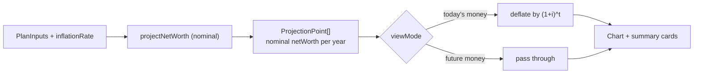

# Inflation and real view

## Goal

Make the planner produce and display internally-consistent numbers by introducing **inflation**, then let the user flip between **Today's money** (real) and **Future money** (nominal) on the chart and summary cards.

## Decisions baked in

- **Default view:** Today's money (real). Matches every input labeled "in today's money" and matches Boldin's default.
- **What inflates each year (automatically):**
  - `annualIncome` (Salary)
  - `monthlySpending` (Recurring monthly expenses)
  - `windfallAmount` (inflated from today's money to the nominal amount at the landing year)
- **What is treated as already-nominal (user-controlled growth):**
  - `nominalReturn` (portfolio return)
  - `primaryResidenceRate`, `otherPropertyRate` (property appreciation)
  - `rentalIncomeRate` (rental-income growth)
- **What stays flat nominally (and therefore loses real value over time — correct):**
  - `cashBalance`, `nonLiquidInvestments`, `otherFixedAssets`, `startDebt`
- **Calculator still outputs nominal `netWorth`** per point. A display helper converts to real when needed. No data-model shape changes.

## Why this matters (one diagram)



## Data model

[app/src/features/planner/types.ts](app/src/features/planner/types.ts) — add one field:

```ts
inflationRate: number; // annual inflation, e.g. 0.02 for 2%
```

Default in `DEFAULT_PLAN_INPUTS`: `inflationRate: 0.02`.

Existing `loadInputs` already merges stored values over defaults ([app/src/features/planner/storage.ts](app/src/features/planner/storage.ts) line 11), so no storage migration is needed.

## Calculator

[app/src/features/planner/calculator.ts](app/src/features/planner/calculator.ts) — adjust the per-year loop so the nominal projection already bakes in inflation-grown flows:

```ts
// Inflate salary and spending from today's money to year i's nominal value.
const inflator = (1 + input.inflationRate) ** i;
const salaryNominal = input.annualIncome * inflator;
const spendingNominal = input.monthlySpending * 12 * inflator;

rental *= 1 + input.rentalIncomeRate; // already nominal, unchanged

const afterReturn = assets * (1 + input.nominalReturn);
const netFlow = salaryNominal + rental - spendingNominal;
// shortfall/drain logic unchanged

// Windfall: user enters today's money; inflate to the landing year's nominal value.
if (startYear + i === input.windfallYear && input.windfallAmount > 0) {
  assets += input.windfallAmount * (1 + input.inflationRate) ** i;
}
```

Setting `inflationRate = 0` reproduces today's behavior exactly (important for the existing test suite — most tests use 0 by default).

Add a sibling pure helper in the same file for the display transform:

```ts
export function deflateToToday(
  points: ProjectionPoint[],
  inflationRate: number,
  startYear: number
): ProjectionPoint[] {
  if (inflationRate === 0) return points;
  return points.map((p) => ({
    ...p,
    netWorth: p.netWorth / (1 + inflationRate) ** (p.year - startYear)
  }));
}
```

## Form

[app/src/features/planner/PlannerForm.tsx](app/src/features/planner/PlannerForm.tsx):

- Add an `INFLATION_SLIDER` spec: `{ min: 0, max: 0.08, step: 0.0025, format: percent }`.
- Place its `SliderRow` **just above the Projection horizon slider** (both are meta-parameters of the model, outside the three category fieldsets).

## View-mode toggle

[app/src/features/planner/PlannerPage.tsx](app/src/features/planner/PlannerPage.tsx):

- New local state: `const [viewMode, setViewMode] = useState<"real" | "nominal">("real")`.
- New small component `ViewModeToggle` (segmented control, two buttons: Today's money | Future money) rendered in the chart card header, replacing the current `{projection.length - 1} yr horizon` eyebrow (move that into a tooltip or drop it — it's already visible in the Projection ends card).
- Compute once:
  ```ts
  const nominal = useMemo(() => projectNetWorth(inputs), [inputs]);
  const startYear = nominal[0]?.year ?? new Date().getFullYear();
  const displayed = viewMode === "real"
    ? deflateToToday(nominal, inputs.inflationRate, startYear)
    : nominal;
  ```
- Pass `displayed` to `ProjectionChart` and use `displayed.at(-1)?.netWorth` for the Projected-net-worth summary card.
- Append a tiny suffix to the card's eyebrow so it's clear which basis is shown: `"Projected net worth at age X · today's money"` or `"· future money"`.

No changes needed to [app/src/features/planner/ProjectionChart.tsx](app/src/features/planner/ProjectionChart.tsx) — it already renders whatever points it's given.

## Tests

### [app/src/features/planner/calculator.test.ts](app/src/features/planner/calculator.test.ts)

- Extend `BASE_INPUTS` with `inflationRate: 0` (preserves every existing assertion).
- New cases:
  - With `inflationRate = 0.02` and nonzero salary/spending, the year-1 NW matches the hand-computed nominal value using inflated flows.
  - With `inflationRate > 0` and all other growth rates zero, `cashBalance`'s nominal value stays constant across years (cash doesn't inflate nominally).
  - Windfall of `100_000` in today's money, inflation `0.05`, landing in year 10 → nominal deposit equals `100_000 * 1.05^10` at year 10.
  - `deflateToToday` round-trips: year-0 point is unchanged; year-t point equals nominal / `(1 + i)^t`.
  - `deflateToToday` with `inflationRate = 0` returns the input array untouched (no-op fast path).

### [app/src/features/planner/PlannerForm.test.tsx](app/src/features/planner/PlannerForm.test.tsx)

- Add: the Inflation slider renders with its label, and sits outside the three category fieldsets (same assertion style as the Projection horizon test).

### [app/src/features/planner/PlannerPage.test.tsx](app/src/features/planner/PlannerPage.test.tsx)

- Add: the toggle renders both options with Today's money selected by default.
- Add: clicking Future money updates the Projected-net-worth card to a **larger** number (strict inequality: nominal > real when inflation > 0 and horizon > 0).
- Add: clicking back to Today's money restores the smaller number.

## Branch + workflow

1. `git checkout -b feat/inflation-and-real-view` off `main`.
2. Implement: types → calculator → form → page → tests.
3. `npm run lint && npm run typecheck && npm run test`.
4. `git push -u origin HEAD` → `gh pr create --fill` → wait for CI → `gh pr merge --squash --delete-branch` → pull `main`.

## Out of scope (flag for later)

- Separate inflation rates for spending vs. general CPI (e.g. healthcare inflation).
- Real-mode slider labels ("Expected real annual return" instead of nominal) — we keep `nominalReturn` as-is for now to avoid churn.
- Comparing the two modes side-by-side on the same chart (dashed real line over solid nominal bars).
- Persisting the user's viewMode preference across sessions (localStorage).