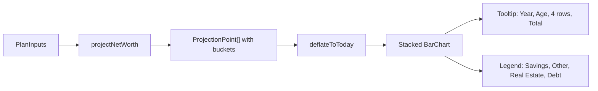

## Data model

Extend `ProjectionPoint` in [app/src/features/planner/types.ts](app/src/features/planner/types.ts) with per-year bucket values so the chart can stack them. Keep `netWorth` and `liquid` so `PlannerPage` and the existing Liquid chart keep working unchanged.

```ts
export type ProjectionPoint = {
  year: number;
  age: number;
  netWorth: number;
  liquid: number;
  savings: number;      // cash + financial portfolio (can be negative in shortfall)
  otherAssets: number;  // nonLiquidInvestments + otherFixedAssets (static)
  realEstate: number;   // residence + otherProp (compounded)
  debt: number;         // startDebt (constant, non-negative)
};
```

## Calculator

In [app/src/features/planner/calculator.ts](app/src/features/planner/calculator.ts):

- Inside the loop in `projectNetWorth`, emit the four buckets on each point. `savings = assets + cash`, `otherAssets = nonLiquid + otherFixed`, `realEstate = residence + otherProp`, `debt = input.startDebt`. `netWorth` stays `realEstate + savings + otherAssets - debt` (identical sum).
- Update `deflateToToday` to divide `savings`, `otherAssets`, `realEstate`, and `debt` by the same inflator as `netWorth`/`liquid`.

## Chart

Rewrite [app/src/features/planner/ProjectionChart.tsx](app/src/features/planner/ProjectionChart.tsx) as a stacked bar chart:

- Four `<Bar stackId="a">` series: `savings`, `otherAssets`, `realEstate`, and a derived `debtNeg = -debt` so debt renders below the zero line (recharts stacks negatives and positives separately, yielding the screenshot's two-sided bars).
- Add `<ReferenceLine y={0}>` and a `<Legend>` pinned to the bottom with the four colored dots.
- Bar colors: Savings `#00a385` (deeper teal), Real Estate `#9fe3dc` (mint), Other Assets `#d9b861` (muted gold, new), Debt `#ff7a59` (coral). Use the radius only on the outermost segment in each direction so the bar looks continuous.
- Replace `ChartTooltip` with a card that renders, in order:
  - Year header (bold) and `Age {age}` sub-label.
  - A row per series with a colored dot, label, and right-aligned formatted value.
  - A divider, then a `Total` row showing `netWorth`, colored coral when negative.
- Hide the `Other Assets` row in the tooltip when it's exactly 0 so simple plans stay clean.

## Page and tests

- [app/src/features/planner/PlannerPage.tsx](app/src/features/planner/PlannerPage.tsx) keeps passing `displayed` to `<ProjectionChart />`; no changes needed.
- Extend [app/src/features/planner/calculator.test.ts](app/src/features/planner/calculator.test.ts) with a new describe block verifying per-bucket values at year 0 and year 1 for a known input, and that `savings + otherAssets + realEstate - debt === netWorth` at every point. Update the two `mk()` helpers in the existing `deflateToToday`/`liquid` describes so they populate the new fields (default to 0) to satisfy the type.
- No updates needed in [app/src/features/planner/PlannerPage.test.tsx](app/src/features/planner/PlannerPage.test.tsx) beyond what the type requires (it doesn't read the new fields).

## Visual contract

