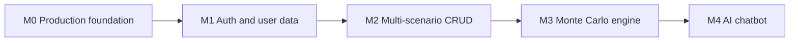
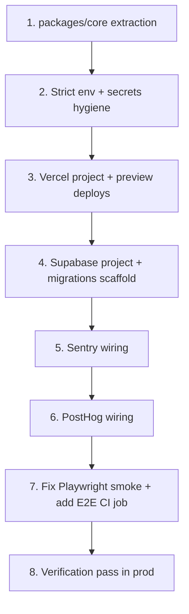

## Recommendations for the open questions

- **Stack**: go all-in on **Supabase (Auth + Postgres + RLS) on Vercel**. It is already in `.env.example` and deps (`@supabase/ssr`, `@supabase/supabase-js`), collapses three services (auth, DB, storage) into one, and RLS makes "scenarios belong to a user" almost free. Lowest code + lowest vendor count for where you are.
- **Monte Carlo**: run **client-side in a Web Worker**. Typical retirement MC (5k–10k paths, 30–60 years) completes in &lt;1s in-browser, costs zero server compute (nice since billing is deferred), preserves the "inputs stay on your device" story in [app/src/components/SiteFooter.tsx](app/src/components/SiteFooter.tsx), and keeps a server path available later for bigger sims if ever needed.
- **Billing**: deferred per your answer. Stripe stubs in [app/src/app/api/billing/checkout/route.ts](app/src/app/api/billing/checkout/route.ts) and [app/src/app/api/webhooks/stripe/route.ts](app/src/app/api/webhooks/stripe/route.ts) stay untouched until a later cycle.

## Logical ordering (why this order)

Each milestone unblocks the next, and each one is shippable on its own:



- M0 first because every later milestone benefits from being validated in prod with real observability.
- M1 before M2 because "multiple scenarios per account" is meaningless without accounts.
- M2 before M3 because the MC engine reads from a scenario; wiring it to a single localStorage blob would create a throwaway integration.
- M3 before M4 because the chatbot's most valuable job ("explain the simulation, tweak the inputs") requires both the scenario model and the MC outputs to exist.

## Milestone 0 — Production foundation (detailed)

**Goal**: Get today's deterministic planner (still using `localStorage`) running in production on the commercial stack, with observability, a shared-core package ready for M1–M4, and CI/CD that blocks regressions. No user-facing feature changes.

**Assumptions** (override if wrong): no pre-existing Vercel / Supabase / Sentry / PostHog accounts; deploy to a free `*.vercel.app` subdomain; Supabase region **EU (Frankfurt / `eu-central-1`)**; trunk-based branching on `main` with PR preview deploys — repo is already at `github.com/lejeff/saas-browser-app`.

Region note: EU hosting has implications downstream — pick PostHog EU cloud (`https://eu.i.posthog.com`) instead of US, and prefer Sentry EU (`*.ingest.de.sentry.io`) when creating the Sentry project, so no user data leaves the region.

**Success criteria**:
1. `main` auto-deploys to `<project>.vercel.app` within 2 minutes of merge; PRs get preview URLs.
2. A thrown error in any environment appears in Sentry within 60s, and page views appear in PostHog.
3. CI runs lint, typecheck, unit tests, E2E smoke, and build on every PR; E2E smoke passes against the actual current UI.
4. `packages/core` exists and exports `PlanInputsSchema` (Zod) + `projectNetWorth`; `app/` imports them — no duplication of types left in `app/src/features/planner/`.
5. No secrets in the repo; `.env.example` matches the runtime-required schema; `env.ts` is strict in prod (no dev-default fallbacks when `NODE_ENV === "production"`).

### Step-by-step breakdown



### 1. Extract shared core into `packages/core`

Rationale: doing this first means every subsequent M0 step (env schema, Sentry tags, etc.) can already reference the shared types; it also unblocks M1–M4 without a later refactor.

- Create `packages/core/package.json` with `"name": "@app/core"`, `"main": "./src/index.ts"`, `"types": "./src/index.ts"`, and `"sideEffects": false`.
- Create `packages/core/tsconfig.json` extending the app's TS config (strict, `moduleResolution: "bundler"`).
- Move, don't copy:
  - [app/src/features/planner/types.ts](app/src/features/planner/types.ts) → `packages/core/src/planInputs.ts` (rename to avoid the generic name).
  - Pure functions from [app/src/features/planner/calculator.ts](app/src/features/planner/calculator.ts) (`ageFromDob`, `clampHorizon`, `projectNetWorth`, `deflateToToday`, the `MIN/MAX_*` constants) → `packages/core/src/projection.ts`.
- Add a Zod schema alongside the type. Today `PlanInputs` is just a TS type; M1 needs a runtime validator for DB writes, so introduce it now:

```typescript
// packages/core/src/planInputs.ts (new)
export const PlanInputsSchema = z.object({
  name: z.string(),
  dateOfBirth: z.string().regex(/^\d{4}-\d{2}-\d{2}$/),
  startAssets: z.number().nonnegative(),
  startDebt: z.number().nonnegative(),
  // ...one entry per field in the current PlanInputs type...
  nominalReturn: z.number().min(MIN_APPRECIATION).max(MAX_APPRECIATION),
  inflationRate: z.number().min(-0.05).max(0.15),
  horizonYears: z.number().int().min(MIN_HORIZON_YEARS).max(MAX_HORIZON_YEARS),
});
export type PlanInputs = z.infer<typeof PlanInputsSchema>;
```

- Export a barrel `packages/core/src/index.ts`: `export * from "./planInputs"; export * from "./projection";`.
- Add `"@app/core": "*"` to `app/package.json` dependencies (npm workspaces resolves it via symlink).
- Replace every import in `app/src/**` of `./features/planner/types` and `./features/planner/calculator` with `@app/core`. Delete the now-empty originals. Keep `DEFAULT_PLAN_INPUTS` in core too (so tests and forms share it).
- Move the existing Vitest tests that exercise pure logic ([app/src/features/planner/calculator.test.ts](app/src/features/planner/calculator.test.ts)) into `packages/core/src/projection.test.ts`. Update root `package.json` `"test"` script to run vitest across the workspace: `"test": "vitest run"` at root with a root `vitest.config.ts` that globs both `app/src` and `packages/*/src`.
- Verify `npm run typecheck && npm run test && npm run build` is green before moving on.

### 2. Strict env schema + secrets hygiene

The current [app/src/lib/env.ts](app/src/lib/env.ts) silently defaults every required key to a fake dev value, which is a production footgun — a missing `SUPABASE_SERVICE_ROLE_KEY` in Vercel would parse successfully as `"dev-service-role-key"`.

- Split the schema into three zones:
  - **Build-time public**: `NEXT_PUBLIC_APP_URL`, `NEXT_PUBLIC_SUPABASE_URL`, `NEXT_PUBLIC_SUPABASE_ANON_KEY`, `NEXT_PUBLIC_POSTHOG_KEY`, `NEXT_PUBLIC_POSTHOG_HOST`, `NEXT_PUBLIC_SENTRY_DSN`.
  - **Server-only runtime**: `SUPABASE_SERVICE_ROLE_KEY`, `SENTRY_AUTH_TOKEN` (new, for sourcemap upload), and the already-present Stripe/Resend ones. Keep these in a separate `serverEnv` that is only imported from server-only files.
  - **Optional in dev, required in prod**: change the schema to `z.string().min(1)` with no `.default()`, and in dev add a small `process.env.NODE_ENV !== "production"` branch that fills defaults *before* `.parse` runs, so prod-missing values fail loudly.
- Add a `.env.local.example` alongside `.env.example` that documents which vars are server-only (so contributors don't paste service-role keys into `NEXT_PUBLIC_*`).
- Add `app/src/lib/env.server.ts` that re-exports server-only keys and has a top-of-file comment `import "server-only";` (using Next.js's [`server-only`](https://www.npmjs.com/package/server-only) package) so accidental client imports fail the build.
- Confirm `.env.local` is in [.gitignore](.gitignore).

### 3. Vercel project + preview deploys

- Create a new Vercel project, connect the `lejeff/saas-browser-app` GitHub repo, set:
  - **Root directory**: leave at repo root (monorepo), Vercel auto-detects Next.js.
  - **Build command**: `npm run build` (root).
  - **Install command**: `npm ci --include=optional --no-audit --no-fund` (matches [.github/workflows/ci.yml](.github/workflows/ci.yml)).
  - **Output directory**: `app/.next` (Vercel usually detects, but set explicitly for monorepo).
  - **Node version**: 22 (matches [.nvmrc](.nvmrc) and CI).
- Populate env vars in Vercel's dashboard for all three environments (Production, Preview, Development): real values for Supabase URL/anon key (step 4), Sentry DSN + auth token (step 5), PostHog key + host (step 6). Leave Stripe/Resend empty for now — their routes are unused until a later milestone, but the schema already allows them optional-ish — verify after step 2 changes.
- Pin serverless function execution to an **EU region** (so Next.js route handlers run close to Supabase Frankfurt, minimizing latency and keeping request/response data in-region). Add a minimal `vercel.json` at repo root:
  ```json
  {
    "regions": ["fra1"]
  }
  ```
  This applies to Node/Edge functions; static assets still serve from Vercel's global edge.
- Enable "Comments on PRs" and "Preview Deployment Protection" (password-gate previews) in Vercel settings.

### 4. Supabase project + migrations scaffold

No tables yet — M0 just wires the plumbing so M1 can land without touching infra.

- Create a Supabase project, region **EU (Frankfurt, `eu-central-1`)**.
- Add `supabase` CLI as a root devDependency: `npm i -D -w . supabase`. Add root scripts:

```json
"db:start": "supabase start",
"db:diff":  "supabase db diff -f",
"db:push":  "supabase db push",
"db:reset": "supabase db reset"
```

- Run `npx supabase init` at repo root (creates `supabase/config.toml`, `supabase/migrations/`). Commit the `supabase/` folder.
- Link the local project: `npx supabase link --project-ref <ref>`. Document this in the README.
- Add an initial empty migration `supabase/migrations/0000_init.sql` with only a comment so the folder isn't empty and CI can verify the CLI works: `-- init; schema introduced in M1`.
- Add a lightweight CI check job that runs `npx supabase db lint` against the migrations folder (skips on pull requests from forks).
- Capture the URL, anon key, service-role key → paste into Vercel env vars (all 3 environments).

### 5. Sentry wiring

Today [app/src/lib/observability.ts](app/src/lib/observability.ts) is a `console` stub. Replace it with real Sentry in all three Next.js runtimes.

- Create the Sentry project in the **EU region** (DSN looks like `https://<key>.ingest.de.sentry.io/<id>`) so event data stays in the EU.
- `npx @sentry/wizard@latest -i nextjs --skip-connect` from inside `app/` to generate `sentry.client.config.ts`, `sentry.server.config.ts`, `sentry.edge.config.ts`, `instrumentation.ts`, and `next.config.ts` updates.
- Audit the generated `next.config.ts` — merge with the existing headers config in [app/next.config.ts](app/next.config.ts) using `withSentryConfig(...)`. Preserve the `X-Frame-Options`, `X-Content-Type-Options`, and `Referrer-Policy` headers.
- Tune the generated configs:
  - `tracesSampleRate: 0.1` in prod, `1.0` in dev.
  - `replaysSessionSampleRate: 0`, `replaysOnErrorSampleRate: 0.1` (session replay on errors only — cost + privacy).
  - `environment: process.env.VERCEL_ENV ?? process.env.NODE_ENV` so preview / prod separate in Sentry UI.
  - `release: process.env.VERCEL_GIT_COMMIT_SHA` — free release-tagging on Vercel.
- Rewrite [app/src/lib/observability.ts](app/src/lib/observability.ts) to delegate to `Sentry.captureException` and `Sentry.captureMessage`. Keep the existing exported API (`captureServerError`, `trackProductEvent`) so no feature code changes.
- Add `SENTRY_AUTH_TOKEN` to Vercel env for Production + Preview only (not Development) so sourcemaps upload on Vercel builds.
- Smoke test: add a temporary button on a dev-only route that throws, verify it lands in Sentry. Remove before merging.

### 6. PostHog wiring

- `npm i -w app posthog-js` (already installed — confirm version is current).
- Create `app/src/app/providers.tsx` as a client component wrapping children in a PostHog provider initialized with `NEXT_PUBLIC_POSTHOG_KEY` + `NEXT_PUBLIC_POSTHOG_HOST`; gate init with `if (typeof window !== "undefined" && key)`.
- Edit [app/src/app/layout.tsx](app/src/app/layout.tsx) to render `<Providers>{children}</Providers>` inside `<body>`.
- Use **PostHog EU Cloud**: set `NEXT_PUBLIC_POSTHOG_HOST=https://eu.i.posthog.com` in Vercel env for all three environments, and create the PostHog project in the EU region.
- Enable **reverse proxy** via Next.js rewrite in [app/next.config.ts](app/next.config.ts) pointing at the EU host:
  ```typescript
  async rewrites() {
    return [
      { source: "/ingest/:path*", destination: "https://eu.i.posthog.com/:path*" },
    ];
  }
  ```
  And set PostHog config `api_host: "/ingest"`. This avoids the public key being blocked by ad-blockers and keeps ingest on first-party domain.
- Rewrite `trackProductEvent` in `observability.ts` (both client and server paths) to use PostHog's client capture on the browser and PostHog's Node SDK for server events (optional for M0 — can stay client-only).
- Add an `identify()` call as a no-op stub now (it becomes useful in M1 when `auth.uid()` is known).
- Disable autocapture of sensitive form fields: add `data-ph-no-capture` attributes to any input in `PlannerForm.tsx` showing financial numbers, or set `autocapture: { dom_event_allowlist: ["click"] }` in init config. Revisit in M1.
- **GDPR / consent (EU implication)**: PostHog sets a `distinct_id` cookie on first load, which under strict GDPR interpretation is non-essential and requires prior opt-in. For M0 (pre-auth, anonymous usage only), initialize PostHog with `persistence: "memory"` so no cookies/localStorage are set, and switch to `"localStorage+cookie"` in M1 once we add a consent banner tied to sign-in. Flag a consent banner as an explicit prerequisite in M1 before any identified-user tracking.

### 7. Fix the Playwright smoke and wire E2E into CI

[tests/e2e/smoke.spec.ts](tests/e2e/smoke.spec.ts) looks for `"Commercial SaaS Starter"`, which does not exist on the page — so [.github/workflows/ci.yml](.github/workflows/ci.yml) would fail if E2E ran (it currently doesn't).

- Rewrite the smoke to assert text that actually appears on the home page today. Based on current UI copy:
  ```typescript
  await page.goto("/");
  await expect(page.getByRole("heading", { name: /retirement planner/i })).toBeVisible();
  await expect(page.getByRole("textbox", { name: /annual income/i })).toBeVisible();
  ```
- Add a second smoke that: fills a couple of inputs, verifies the projection chart renders a non-empty SVG. This becomes the M0 regression backstop.
- Add a new CI job in [.github/workflows/ci.yml](.github/workflows/ci.yml) alongside `checks`:
  ```yaml
  e2e:
    runs-on: ubuntu-latest
    needs: checks
    steps:
      - uses: actions/checkout@v4
      - uses: actions/setup-node@v4
        with: { node-version: 22, cache: npm }
      - run: npm ci --include=optional --no-audit --no-fund
      - run: npx playwright install --with-deps chromium
      - run: npm run test:e2e
  ```
- Enable branch protection on `main` requiring both `checks` and `e2e` to pass — document in [infra/github-setup.md](infra/github-setup.md).

### 8. Verification pass in prod

Once all above is merged and deployed:

- Visit `<project>.vercel.app` — form works, charts render.
- Hit a nonexistent route like `/api/__boom` (add a temporary throwing route, then remove) → Sentry issue arrives, tagged `environment=production` and `release=<commit SHA>`.
- Reload home a few times → PostHog dashboard shows pageviews from `production` host.
- Open a throwaway PR with a trivial change → preview URL is posted in the PR, and error/event segmentation works under `environment=preview`.
- Tag the commit `m0-foundation` and move on to M1.

### Deliverables (what exists after M0)

- `packages/core/` with shared Zod schema + pure projection code, used by `app/`.
- Strict, three-zone env validation; `.env.example` aligned with runtime requirements.
- Vercel production + preview deploys driven by Git pushes.
- Supabase project linked, `supabase/migrations/` scaffold, CLI scripts in root `package.json`.
- Real Sentry in all three Next.js runtimes with release + environment tagging; sourcemaps uploaded on Vercel.
- PostHog analytics via a reverse-proxied ingest path in [next.config.ts](app/next.config.ts), autocapture privacy-tuned.
- Green CI with lint, typecheck, unit, E2E smoke, and build on every PR; E2E asserts current UI copy.

### Risks and mitigations

- **EU region lock-in**: Supabase region is not changeable after project creation — if EU-origin assumptions change later, migration requires `pg_dump` / `pg_restore`. Frankfurt (`eu-central-1` / Vercel `fra1`) is confirmed for M0.
- **Monorepo + Vercel gotchas** (Vercel sometimes ignores workspace packages at build): if Vercel build fails resolving `@app/core`, add `"outputFileTracingIncludes": { "/*": ["../packages/**"] }` to `next.config.ts` — do this only if needed to keep diffs small.
- **CSP drift as we add PostHog + Sentry + later AI provider**: [app/next.config.ts](app/next.config.ts) currently has no `Content-Security-Policy` header — M0 keeps it that way (adding CSP is a dedicated M0.1 mini-task if scope allows), but note it in [infra/launch-checklist.md](infra/launch-checklist.md) as a known gap to close before M1 ships user auth.
- **Migration file CI check** will fail if Docker is unavailable on the CI runner; `supabase db lint` only needs static SQL parsing, not Docker — verify before relying on it.

### Out of scope for M0 (explicitly deferred)

- Auth, any database table beyond scaffolding, any change to what a user sees or does in the UI.
- CSP header, rate-limit beyond the existing [app/src/server/security/rate-limit.ts](app/src/server/security/rate-limit.ts).
- Stripe wiring (Stripe routes remain as-is; they won't be exercised in M0).
- Multi-environment Supabase (one project, branching to be considered in M1).

## Milestone 1 — Accounts and persistent user data

Introduce authentication and a user-scoped data store, but keep only one "plan" per user for now (migrate the existing localStorage blob shape unchanged).

- Add `middleware.ts` using `@supabase/ssr` to refresh sessions on every request (Supabase's standard Next.js 15 App Router pattern).
- Add routes `/(auth)/sign-in` and `/(auth)/sign-up` with email + magic link (Supabase Auth). Add `/auth/callback/route.ts` for the PKCE exchange.
- Create a `profiles` table keyed by `auth.users.id` with RLS `auth.uid() = id`; add a trigger `on auth.users insert -> insert into profiles`.
- Create a `plans` table (single row per user for now) with `inputs jsonb` validated against the shared Zod schema from `packages/core`, plus RLS `auth.uid() = user_id`.
- Refactor [app/src/features/planner/storage.ts](app/src/features/planner/storage.ts) into a **repository** behind an interface: `PlanRepository` with `LocalStoragePlanRepository` (anon users) and `SupabasePlanRepository` (signed-in users). `PlannerPage.tsx` consumes the interface — swapping is one line.
- One-time migration on first sign-in: if localStorage has `planner.inputs.v1` and the DB row is empty, upload it and mark it migrated. Keep anonymous use working.
- **Tech-debt prevention**: repository pattern + Zod at the DB boundary means later vendor swaps or schema changes are contained. No Supabase imports leak into feature components.

## Milestone 2 — Multiple saved scenarios per account

Generalize "the one plan" into a list of named scenarios owned by the user.

- Drop the `plans` table, replace with `scenarios (id, user_id, name, inputs jsonb, created_at, updated_at, archived_at)` with the same RLS. Provide a migration that moves the M1 single-row data into a default-named scenario.
- New routes: `/scenarios` (list), `/scenarios/[id]` (editor — this is today's `PlannerPage`), `/scenarios/new`.
- Sidebar / header scenario switcher; actions: create, rename, duplicate, archive.
- Debounced autosave per scenario (e.g. 500ms) with a visible "saved" indicator; optimistic UI via React 19 transitions.
- Add a `scenarios` index on `(user_id, updated_at desc)` up front so list queries stay fast.
- **Tech-debt prevention**: all scenario fetching goes through a thin `ScenarioRepository` in `packages/core` with typed errors. Don't sprinkle Supabase calls across components.

## Milestone 3 — Monte Carlo simulations

Add a stochastic layer next to the deterministic projector, executed off the main thread.

- Extend `PlanInputs` in `packages/core` with stochastic assumptions: expected return mean and volatility per asset class, inflation distribution, correlation assumptions, path count (default 10,000), and seed (for reproducibility). Keep backwards compatibility — deterministic view still works with defaults.
- New pure module `packages/core/src/monteCarlo.ts`: takes `PlanInputs`, returns `{ paths, percentiles, successProbability }`. Uses a seeded PRNG (e.g. `seedrandom`) so runs are reproducible and cacheable.
- New **Web Worker** at `app/src/features/planner/monteCarlo.worker.ts` wrapped with a typed `useMonteCarlo(inputs)` React hook that debounces, cancels stale runs, and reports progress.
- New visualizations in a `MonteCarloPanel` component: fan chart (P10/P50/P90), success probability gauge, distribution of terminal net worth. Reuse Recharts.
- Cache results on the `scenarios` row: `last_simulation jsonb` (percentiles + success prob only, not all paths) so the list view can show each scenario's success probability without re-running.
- **Tech-debt prevention**: MC engine is a **pure function** in `packages/core`, fully unit-testable in Vitest with deterministic seeds, with no DOM or Supabase dependency. The worker is a thin adapter. This keeps the door open to a server-side runner later (M3.1 if you ever need more paths) without refactoring feature code.

## Milestone 4 — AI chatbot

Two jobs: (1) explain the current scenario and its MC results, (2) draft a new scenario from a plain-language description.

- Pick **Vercel AI SDK** (`ai` package) with OpenAI or Anthropic as provider. Add `OPENAI_API_KEY` / `ANTHROPIC_API_KEY` to env schema in [app/src/lib/env.ts](app/src/lib/env.ts).
- New API route `app/src/app/api/chat/route.ts` streaming responses (`streamText`). System prompt is composed server-side from the current scenario and its cached MC results — users can't inject arbitrary context.
- **Tool calling** using the Zod schema from `packages/core` as the tool signature:
    - `updateScenarioInputs(patch: Partial<PlanInputs>)` — Zod-validated on the server before persistence.
    - `runMonteCarlo()` — triggers a client re-run after the tool call.
    - `explainMetric(metricId)` — returns pre-authored explanations; keeps the model from hallucinating financial definitions.
- Persist chat per scenario: `chat_messages (id, scenario_id, user_id, role, content, tool_calls, created_at)` with the same RLS pattern. Keeps history durable and analytics-friendly.
- UI: drawer on the scenario page with streaming messages, tool-call chips ("I updated your savings rate to 15% — re-running simulation…"), and an "Apply all suggestions" button for diff-based edits.
- **Tech-debt prevention**: treat the LLM as an untrusted client. Every tool input is Zod-validated against the shared schema, every output that mutates DB goes through the same `ScenarioRepository` used by the UI. No separate "AI write path".

## Cross-cutting quality gates (apply to every milestone)

- Every new feature lands with: a Vitest unit test in `packages/core` if it has pure logic, a component test in `app/src/**/*.test.tsx`, and (for flows with a UI path) one Playwright happy-path spec.
- Every DB change is a file in `supabase/migrations/`. CI runs `supabase db lint` before merge.
- Every new `.env` key is added to [.env.example](.env.example) and the Zod schema in [app/src/lib/env.ts](app/src/lib/env.ts) in the same PR.
- Security headers already in [app/next.config.ts](app/next.config.ts) stay strict as new domains are added (AI provider, PostHog, Sentry — audit CSP at each milestone).
- Re-evaluate billing at the end of M4: by then Monte Carlo and AI chat are natural paywall candidates.