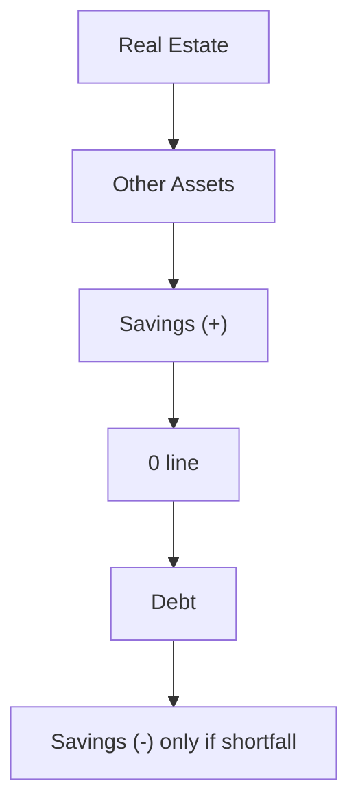

## Change

In [app/src/features/planner/ProjectionChart.tsx](app/src/features/planner/ProjectionChart.tsx), render the `debtNeg` `<Bar>` first and the asset bars after. Recharts stacks bars within a `stackId` in render order outward from the baseline: for negatives, the first bar rendered is closest to 0 and each subsequent bar stacks further down. The current order renders `debtNeg` last, placing it at the bottom of the negative stack — the opposite of what we want.

New order inside `<BarChart>`:

```tsx
{hasDebt ? (
  <Bar dataKey="debtNeg" name="Debt" stackId="a" fill={DEBT} radius={[0, 0, 6, 6]} isAnimationActive={false} />
) : null}
<Bar dataKey="savings" name="Savings" stackId="a" fill={SAVINGS} isAnimationActive={false} />
{hasOther ? (
  <Bar dataKey="otherAssets" name="Other Assets" stackId="a" fill={OTHER} isAnimationActive={false} />
) : null}
<Bar dataKey="realEstate" name="Real Estate" stackId="a" fill={REAL_ESTATE} radius={[6, 6, 0, 0]} isAnimationActive={false} />
```

Result per year:

- Positive stack (above 0): `savings` (if positive) at the baseline, then `otherAssets`, then `realEstate` on top. Unchanged.
- Negative stack (below 0): `debtNeg` directly under 0, then any negative `savings` stacks further below it.

## Legend and tooltip

No changes. `Legend` reads its entries from the Bar components but our custom `ChartLegend` just renders whatever payload Recharts hands it; the order will reflect the new render order (Debt first). If you'd rather keep the legend reading "Savings, Other Assets, Real Estate, Debt" left to right, I can give the legend a fixed payload — flag me on the next turn if you want that.

The tooltip is driven by an explicit `rows` array in `ChartTooltip` and doesn't depend on Bar order, so it stays Savings → Other → Real Estate → Debt → Total.

## Visual



## Colors

Update the color constants at the top of [app/src/features/planner/ProjectionChart.tsx](app/src/features/planner/ProjectionChart.tsx):

- `SAVINGS`: `#b5e5c2` → `#58b17b` (medium green, the new dark shade)
- `REAL_ESTATE`: `#2d7a4a` → `#b5e6cf` (pale mint, the new light shade)
- `OTHER`: `#a8cde8` (unchanged, light blue)
- `DEBT`: `#ff7a59` (unchanged, coral)

These constants drive the `<Bar fill>` props, the `ChartLegend` dots, and the tooltip row markers, so one change propagates everywhere.

## Tests

No test changes required — the stack order and colors are render details and the calculator invariants still hold.