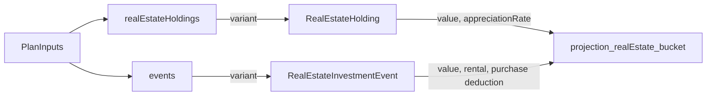

# Real Estate as stackable holdings

## Goal

Refactor the Real Estate inputs from two fixed slots (`primaryResidenceValue` / `primaryResidenceRate` / `otherPropertyValue` / `otherPropertyRate`) into a user-addable list of cards, reusing the discriminated-union + Add/Remove pattern from `RealEstateInvestmentEvent` in [`packages/core/src/planInputs.ts`](packages/core/src/planInputs.ts) and the card UI from `RealEstateInvestmentCard` in [`app/src/features/planner/PlannerForm.tsx`](app/src/features/planner/PlannerForm.tsx).

The four legacy fields are removed (no migration — defaults to `[]`). Holdings are owned today and compound from year 0; no purchase-year deduction, no rental-income wiring.

## Architecture mirror

Today's `RealEstateInvestmentEvent` lives in `events: LifeEvent[]` with:
- a Zod variant in `LifeEventSchema`
- a `makeDefault…()` factory with a fresh uuid
- a per-event running state in `projectNetWorth`
- a card component plus an Add button in the form

We re-use exactly that shape for holdings, but in a sibling top-level array (`realEstateHoldings`). The variant is its own schema (not added to `LifeEventSchema`), so the Life Events list and the Real Estate list stay independent.



Both contribute to the same `realEstate` bucket on `ProjectionPoint`.

## File-by-file changes

### 1. `packages/core/src/planInputs.ts`

Add the new variant (after `RealEstateInvestmentEventSchema`):

```ts
export const RealEstateHoldingSchema = z.object({
  id: z.string().min(1),
  type: z.literal("realEstateHolding"),
  value: z.number().finite().nonnegative(),
  appreciationRate: z
    .number()
    .finite()
    .min(MIN_APPRECIATION)
    .max(MAX_APPRECIATION)
});
export type RealEstateHolding = z.infer<typeof RealEstateHoldingSchema>;
```

In `PlanInputsSchema`:
- Remove `primaryResidenceValue`, `otherPropertyValue`, `primaryResidenceRate`, `otherPropertyRate`.
- Add `realEstateHoldings: z.array(RealEstateHoldingSchema)`.

In `DEFAULT_PLAN_INPUTS`:
- Drop the four legacy keys.
- Add `realEstateHoldings: []`.

Add factory mirroring `makeDefaultRealEstateInvestment`:

```ts
export function makeDefaultRealEstateHolding(): RealEstateHolding {
  return {
    id: crypto.randomUUID(),
    type: "realEstateHolding",
    value: 0,
    appreciationRate: 0
  };
}
```

### 2. `packages/core/src/index.ts`

Export `RealEstateHoldingSchema`, `RealEstateHolding`, `makeDefaultRealEstateHolding`.

### 3. `packages/core/src/projection.ts`

In `computeCurrentNetWorth`, replace `input.primaryResidenceValue + input.otherPropertyValue` with `input.realEstateHoldings.reduce((s, h) => s + h.value, 0)`.

In `projectNetWorth`:
- Drop the `residence`/`otherProp` running locals plus their compounding lines.
- Build `holdingStates: Map<string, { value: number }>` seeded from `input.realEstateHoldings`.
- Inside the yearly loop (when `i > 0`), compound each holding: `state.value *= 1 + holding.appreciationRate`.
- In the bucket sum: `realEstate = reInvestmentValue + sum(holdingStates.values().value)`.

No purchase deduction, no rental income — holdings simply replace what `residence + otherProp` used to contribute.

### 4. `app/src/features/planner/PlannerForm.tsx`

In the Real Estate category, replace the four flat fields with a stacked card list mirroring the existing investment cards block (~lines 557-580):

```tsx
<CollapsibleCategory title="Real Estate" ...>
  <div className="space-y-3 pt-2">
    {value.realEstateHoldings.map((holding, index) => (
      <RealEstateHoldingCard
        key={holding.id}
        holding={holding}
        index={index}
        accent={ACCENT.realEstate}
        onChange={(patch) => updateHolding(holding.id, patch)}
        onRemove={() => removeHolding(holding.id)}
      />
    ))}
    <button
      type="button"
      onClick={addRealEstateHolding}
      className="btn-ghost w-full justify-center"
      style={{ borderColor: ACCENT.realEstate, color: ACCENT.realEstate }}
    >
      + Add Real Estate
    </button>
  </div>
</CollapsibleCategory>
```

Add new `RealEstateHoldingCard` component, modelled after `RealEstateInvestmentCard` but with only:
- `Value` (CurrencyField, label "Value")
- `Annual appreciation rate` (SliderRow, reusing the same min/max bounds)
- A Remove button (`aria-label="Remove real estate holding ${index + 1}"`)
- `data-testid="re-holding-card-${index}"`

Add helpers in `PlannerForm`:
- `addRealEstateHolding`
- `updateHolding(id, patch)`
- `removeHolding(id)`

Drop `REAL_ESTATE_AMOUNTS`, `PRIMARY_RESIDENCE_RATE_SLIDER`, `OTHER_PROPERTY_RATE_SLIDER`.

Update `summarizeRealEstate(v, formatCompact)`:
```ts
const total = v.realEstateHoldings.reduce((s, h) => s + h.value, 0);
return total > 0 ? formatCompact(total) : "—";
```

### 5. `app/src/features/planner/storage.ts`

Add a `HoldingsSchema = z.array(RealEstateHoldingSchema)` parallel to `EventsSchema`. In `loadInputs`, validate `parsed.realEstateHoldings` (defaulting to `[]` when missing or malformed) and merge it into the returned object alongside `events`.

### 6. Tests

- `packages/core/src/planInputs.test.ts` — add a `describe("RealEstateHoldingSchema")` block (id required, value ≥ 0, rate within bounds) and a default-factory block; add an `accepts a plan with one real estate holding` case to the `PlanInputsSchema` block.
- `packages/core/src/projection.test.ts` — replace every `primaryResidenceValue`/`otherPropertyValue`/`primaryResidenceRate`/`otherPropertyRate` reference (in `BASE_INPUTS` and the inline overrides at lines 130-176, 405-444, 532-552, 732-754, 1117-1175) with `realEstateHoldings: [{...}, {...}]`. The "compounds … at its own rate / independent rates" tests still pass by using two holdings.
- `app/src/features/planner/PlannerForm.test.tsx` — replace the existing "renders every Real Estate field" test (lines 98-105) with a card-style test set: empty list by default, Add button visible, clicking it stacks `re-holding-card-0`, fields are `Value` + `Annual appreciation rate`, Remove button removes one card, summary updates as cards are added.
- `app/src/features/planner/storage.test.ts` — add `preserves a valid stored realEstateHoldings array on load` and `falls back to [] when stored realEstateHoldings is malformed` parallel to the existing events cases.

### 7. Docs

`docs/architecture.md` §4.1:
- Remove the four `primaryResidenceValue` / `otherPropertyValue` / `primaryResidenceRate` / `otherPropertyRate` rows.
- Add a `realEstateHoldings` row pointing to a new sub-table below.
- Add a `RealEstateHolding` sub-table next to `RealEstateInvestmentEvent` (id / type / value / appreciationRate).

After editing, run `npm run docs:build` to regenerate `docs/architecture.html` and `docs/architecture.pdf` and commit all three.

## Workflow per `/Users/jeffmarois/financial-planner/.cursor/rules/workflow.mdc`

1. Branch `feat/real-estate-holding-cards` off `main`.
2. Implement.
3. `npm run lint`, `npm run typecheck`, `npm test`.
4. **Pause** and ask you to dev-test in `npm run dev`. Specific things to verify:
   - Real Estate category collapsed by default; expanding shows the Add button and no cards.
   - Adding a holding shows a card with Value + Annual appreciation rate; the projection's `realEstate` segment grows when the value/rate change.
   - Two holdings compound independently and the Real Estate summary sums them.
   - Removing a card removes it from the projection.
   - Reset clears all holdings to `[]`.
   - Reload after editing — holdings persist via localStorage.
   - Real Estate Investment cards in Life Events still behave exactly as before (purchase deduction, rental income contribution).
5. Wait for explicit "ship it" before committing, opening the PR, merging, and archiving the plan to `docs/plans/2026-04-28-real-estate-holdings-cards.md` (and bumping the count in `docs/plans/README.md`).