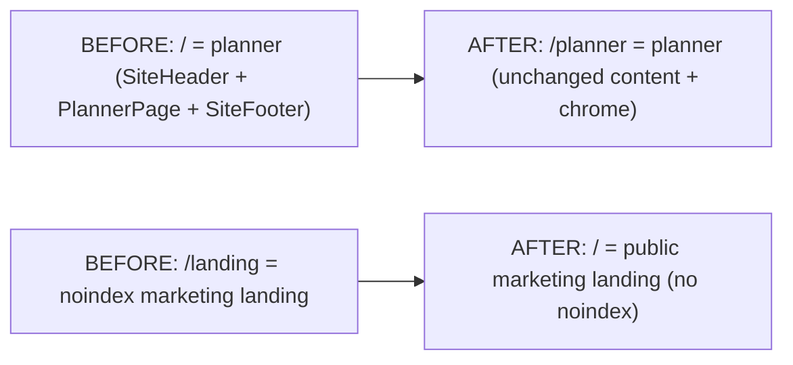

## Routing swap



Two file moves under [`app/src/app/`](app/src/app/):

- Replace [`app/src/app/page.tsx`](app/src/app/page.tsx) with the body of [`app/src/app/landing/page.tsx`](app/src/app/landing/page.tsx). Drop `robots: { index: false, follow: false }` from its `metadata` so the landing is now indexable. Keep the marketing `title` / `description`.
- Move the planner shell to a new file `app/src/app/planner/page.tsx` containing the current `app/src/app/page.tsx` body (the SiteHeader + `<div id="planner">` + PlannerPage + SiteFooter scaffold from the previous PR).
- Delete the now-empty [`app/src/app/landing/`](app/src/app/landing/) directory.

`localStorage` is keyed by origin, not path, so existing planner data survives the move.

## Link rewrites

Every "Planner" / "Get started free" / "Try it free" link in the landing chrome currently points to `/`; rewrite all of them to `/planner`. Logo links currently point to `/landing`; rewrite to `/`.

- [`app/src/components/landing/LandingHero.tsx`](app/src/components/landing/LandingHero.tsx) L63: `href="/"` → `href="/planner"` (Start planning CTA).
- [`app/src/components/landing/FinalCTA.tsx`](app/src/components/landing/FinalCTA.tsx) L30: `href="/"` → `href="/planner"` (Get started free CTA).
- [`app/src/components/landing/LandingHeader.tsx`](app/src/components/landing/LandingHeader.tsx) L51 logo `Link href="/landing"` → `href="/"`; L68, L75, L116 (`Try it free`, desktop `Get started free`, mobile `Get started free`): `href="/"` → `href="/planner"`.
- [`app/src/components/landing/LandingFooter.tsx`](app/src/components/landing/LandingFooter.tsx) L32 logo `Link href="/landing"` → `href="/"`; L69 Planner link `href="/"` → `href="/planner"`.

The `SiteHeader` brand `Link href="/"` (line 28 of [`app/src/components/SiteHeader.tsx`](app/src/components/SiteHeader.tsx)) is already correct — clicking the brand on `/planner` should return to the landing root. No change.

The two in-page anchors `#planner` (SiteHeader nav + "Start planning" CTA, SiteFooter "Planner" link) keep working as same-page scroll targets when the user is on `/planner`. No change.

## Remove "Landing preview" footer link

[`app/src/components/SiteFooter.tsx`](app/src/components/SiteFooter.tsx) L29-33: drop the entire `<li>` block:

```29:33:app/src/components/SiteFooter.tsx
              <li>
                <a href="/landing" className="hover:text-[var(--navy)]">
                  Landing preview
                </a>
              </li>
```

The Product list collapses to two items (`Planner` + `How it works`).

## Tests

- [`tests/e2e/smoke.spec.ts`](tests/e2e/smoke.spec.ts) — keeps passing without edits. It hits `/`, asserts the title matches `/Financial Planner/i`, and asserts a brand link "Financial Planner" is visible. The new landing's metadata title (`"Financial Planner — Plan Your Financial Future with Confidence"`) and `LandingHeader`'s brand link both satisfy those assertions.
- [`app/src/features/planner/PlannerPage.test.tsx`](app/src/features/planner/PlannerPage.test.tsx) — mounts `<PlannerPage />` directly, route-agnostic, no edits.
- No new tests; this is a route + link rewrite with no behavioral change.

## Docs audit

- [`docs/architecture.md`](docs/architecture.md) §2.2 routes bullets — update:
  - `app/src/app/page.tsx — landing + planner UI` → `app/src/app/page.tsx — public marketing landing page`.
  - Remove the existing `app/src/app/landing/page.tsx — work-in-progress marketing landing preview at /landing (robots: noindex, nofollow); reachable from a discreet "Landing preview" link in SiteFooter` line.
  - Add `app/src/app/planner/page.tsx — interactive planner UI at /planner (SiteHeader + stat-card band + PlannerForm + charts)`.
- Run `npm run docs:build` to regenerate `architecture.html` and `architecture.pdf`; commit all three files together (per [`docs/README.md`](docs/README.md) rule).
- Archive this plan as `docs/plans/2026-04-30-promote-landing-to-root.md` and bump the count line in [`docs/plans/README.md`](docs/plans/README.md) (currently `**37 plans** across 7 days.` → `**38 plans** across 7 days.`).
- [`README.md`](README.md), [`ROADMAP.md`](ROADMAP.md), [`.env.example`](.env.example) — confirmed unchanged (no scripts, env, or stack changes; routes don't ripple here).

## Non-goals (call out in the PR body)

- **No `/landing` → `/` redirect.** The old route was `robots: noindex`, surfaced only via the now-removed "Landing preview" footer link. Anyone who hits `/landing` after this ships gets a 404. Add a redirect (e.g. via `next.config` `redirects()`) only if you push back.
- **The dangling `#how` anchors** in `SiteHeader.tsx` and `SiteFooter.tsx` predate this change and aren't made worse by it. Untouched. Same with the now mostly-redundant "Start planning" CTA in the SiteHeader on `/planner`.
- **No copy changes** anywhere. The SiteFooter's "Planner" link still says "Planner"; the LandingHeader's "Try it free" and "Get started free" wording stays as-is.

## Verification gate (per workflow rule)

After lint + typecheck + tests pass, pause for manual verification of:
- `/` renders the landing (`LandingHeader` + hero + showcase + grid + pricing + final CTA + `LandingFooter`). View source: no `<meta name="robots" content="noindex,nofollow">`.
- All landing CTAs land on `/planner`: hero "Start planning", FinalCTA "Get started free", LandingHeader "Try it free" + both desktop and mobile "Get started free", LandingFooter "Planner" link in the Product column.
- `/planner` renders the planner (`SiteHeader` + sticky stat-card band + form + charts + `SiteFooter`). The Product column in `SiteFooter` has only `Planner` and `How it works` — no "Landing preview".
- The `SiteHeader` brand logo on `/planner` returns to `/` (landing).
- Planner data persisted in `localStorage` from before the swap is still loaded on `/planner`.
- `/landing` 404s.

## Ship

New feature branch `feat/promote-landing-to-root` off `main`. Squash-merge after CI green. Default to the workflow's manual-test pause; the user explicitly OK'd a one-off skip on the previous PR but that didn't carry over.