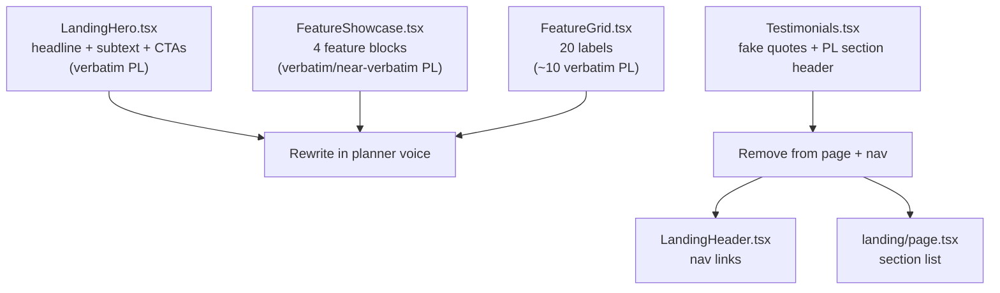

## Scope

Single PR. Five files modified, zero new files, zero new tests (purely presentational).



## 1. [LandingHero.tsx](app/src/components/landing/LandingHero.tsx) — verbatim from PlannerHero

Keep the centered grand layout, sparkles-chip styling, trust-indicators row, and browser-mockup illustration. Swap only the text:

- L42-45 eyebrow chip: replace `Free to use, no account required` with `A calmer way to plan` (chip + sparkles icon stay).
- L48-51 headline: replace `Build Financial Plans You Love` with `Plan the retirement you actually want.`, with `actually` wrapped in `<em className="italic text-[var(--navy-soft)]">` (mirror PlannerHero L12-13).
- L54-57 subtext: replace the 2-sentence PL paragraph with `Drag a few sliders, watch your net worth projection change in real time. Your numbers stay on your device — no account, no tracking, no noise.`
- L65 primary CTA label: `Start planning for free` → `Start planning`.
- L72 secondary CTA label: `See how it works` → `How it works` (anchor stays `#how-it-works`).

Trust indicators (`Privacy-first design` / `Real-time projections` / `Plan in minutes`) and browser mockup unchanged — they're original.

## 2. [FeatureShowcase.tsx](app/src/components/landing/FeatureShowcase.tsx) — full copy rewrite

Section header (L302-308) untouched (no PL match). All four `<FeatureBlock>` props rewritten:

**Block 1** (L313-325)
- eyebrow `Plan with nuance` → `Built around real life`
- title `Capture the details that matter` → `Plan around the moments that move the needle`
- description: `Most calculators hand you one number and call it a day. Drop in the windfalls, the years you go part-time, the property you might buy at forty — and watch each choice reshape the projection in front of you.`
- bullets: `Add the moments worth planning around` / `Pick a target age, a number, or both` / `See how each tweak ripples through the chart` / `Trade vague money worry for a concrete plan`

**Block 2** (L327-340)
- eyebrow `Visualize your future` → `See the whole arc`
- title `See the full picture` (kept — no PL match)
- description: `One chart shows the entire run — today's balance, tomorrow's spending, the year your salary stops. Adjust an input and the projection updates in place, so trade-offs feel concrete instead of theoretical.`
- bullets: `Hover any year to see what's driving the bar` / `Watch cash flow shift as life events land` / `Plan for what you leave behind` / `Test scenarios before you commit to them`

**Block 3** (L342-354)
- eyebrow `Privacy first` (kept)
- title `Your data stays yours` (kept)
- description: `We don't connect to your bank, your brokerage, or anything else. Every number you type stays in your browser, and you decide what happens to it.`
- bullets unchanged (`No account required to get started` / `Data stored locally in your browser` / `Optional export/import to files` / `Zero tracking or data collection`).

**Block 4** (L356-369)
- eyebrow `Track progress` (kept)
- title `Watch your wealth grow` (kept)
- description: `Plug in your real numbers as the years pass and see how the actual path lines up with the projection you started from.`
- bullets: `Track net worth year over year` / `Compare actual vs projected growth` / `Spot trends early` / `Stay grounded as the picture sharpens`

## 3. [FeatureGrid.tsx](app/src/components/landing/FeatureGrid.tsx) — prune from 20 to 12 grounded items

Replace the `features` array (L1-22) with 12 items that map to features the planner actually has today (per [`packages/core/src/planInputs.ts`](packages/core/src/planInputs.ts)):

```ts
const features = [
  { icon: "chart",      label: "Net worth projections",        color: "teal" },
  { icon: "dollar",     label: "Year-by-year cash flow",       color: "coral" },
  { icon: "refresh",    label: "Inflation-adjusted view",      color: "navy" },
  { icon: "globe",      label: "Multiple currencies",          color: "gold" },
  { icon: "home",       label: "Stackable real estate",        color: "teal" },
  { icon: "building",   label: "Rental income per property",   color: "coral" },
  { icon: "trending",   label: "Future windfalls",             color: "navy" },
  { icon: "calculator", label: "Custom debt schedules",        color: "gold" },
  { icon: "target",     label: "Pick your projection horizon", color: "teal" },
  { icon: "clock",      label: "Live updates as you type",     color: "coral" },
  { icon: "lock",       label: "Saved locally, no account",    color: "navy" },
  { icon: "download",   label: "Export your plan to file",     color: "gold" },
];
```

Removes the verbatim-PL labels (`Plan for buying a home`, `Model going part-time`, `Take time off for travel`, `Cash-flow visualization`, `Privacy-friendly`, `Plan as a couple`, `Model rental income`, `More than a calculator`, `Calculate FIRE date`, `Time to FI calculator`). Drops the unused icon entries (`fire`, `briefcase`, `plane`, `scissors`, `shield`, `heart`, `users`, `chart-bar`) from the `icons` map to keep the file tidy.

Section header (L172-179) — `Everything you need` / `Powerful features, simple interface` / `All the tools you need to plan your financial future with confidence.` — kept (no PL match).

## 4. Remove Testimonials from the page + nav

- [`app/src/app/landing/page.tsx`](app/src/app/landing/page.tsx) — delete the `Testimonials` import and the `<Testimonials />` line. Section order becomes `Hero → FeatureShowcase → FeatureGrid → Pricing → FinalCTA`.
- [`app/src/components/landing/LandingHeader.tsx`](app/src/components/landing/LandingHeader.tsx) — delete the `Testimonials` `<a href="#testimonials">` link from the desktop nav AND the mobile menu (4 lines × 2 places).
- [`app/src/components/landing/Testimonials.tsx`](app/src/components/landing/Testimonials.tsx) — keep file in place (unused for now, easy to bring back when you have real quotes).

## 5. Tests, lint, docs

- No test changes — every component is presentational marketing markup with no test coverage today.
- Run `npm run lint`, `npm run typecheck`, `npm test` (expect 378/378 green).
- No `docs/architecture.md` change (no architectural shift).
- No `README.md` change (no new dep).
- `docs/plans/`: archive this plan as `2026-04-30-scrub-pl-text-from-landing.md` and bump the count in `docs/plans/README.md` from 35 → 36.

## Manual verification (paused before ship)

On `http://localhost:3000/landing`:

1. Hero now reads `A calmer way to plan` / `Plan the retirement you *actually* want.` / planner subtext / `Start planning` button.
2. FeatureShowcase: scroll through all four blocks, confirm none of the rewritten passages still appear on projectionlab.com (spot-check the strongest hits like "Plan with nuance" and the long Block-2 description).
3. FeatureGrid shows 12 cards, each label tied to something the planner actually does.
4. Testimonials section is gone. Header nav (desktop + mobile) no longer has a "Testimonials" link.
5. `/` is unaffected (planner hero text didn't change — we adopted FROM it, not modified it).

## Ship

Branch `feat/scrub-pl-text-from-landing`. After your approval: commit, push, PR, watch CI, squash-merge, archive plan, delete branch.

## Rollback

Single squash commit. Revert restores the previous (PL-cribbed) copy. No schema/runtime/dependency impact.

## Implementation note (post-ship)

Mid-implementation the user asked for 3 additional FeatureGrid cards on top of the planned 12 — `Portfolio growth rates`, `Real estate appreciation rates`, and `Liquidity warnings` — each tied to a real planner feature (`nominalReturn`, per-holding `appreciationRate`, the in-app liquidity warning). Two new icons (`percent`, `bell`) were added to the icons map. The shipped grid therefore has 15 cards, not 12, slotted into thematically-related positions (rates near financial-projection cluster, real estate appreciation in the real-estate cluster, liquidity warnings near custom debt schedules). All other plan items shipped exactly as written.
